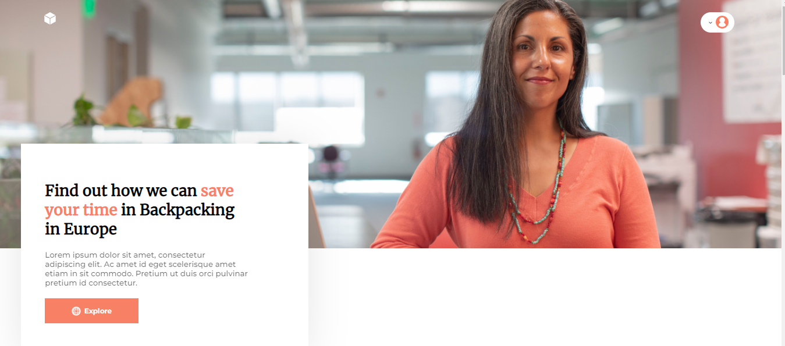

technologies used html and css with the BEM methodology
<h1 style="text-align: center; font-weight: bold;">Backpacking</h1>

## Demo 📸

<div align="center" >
   
</div>
 ---

## Sobre o Projeto
O Projeto Todo foi desenvolvido através do figma para fins de estudo sobre HTML, CSS, METODOLOGIA BEM. E refatorado com SASS

### Link do projeto:  https://deniseschirmer.github.io/layout-backpacking/

### 🛠 Tecnologias
#### As seguintes ferramentas foram usadas na construção do projeto:

- [HTML](https://developer.mozilla.org/en-US/docs/Glossary/HTML5)
- [CSS](https://developer.mozilla.org/en-US/docs/Web/CSS)
- [SASS](https://sass-lang.com/documentation/)
- [BEM](https://en.bem.info/methodology/)

--- 
Antes de começar, você vai precisar ter instalado em sua máquina as seguintes ferramentas:
[Git](https://git-scm.com), [Node.js](https://nodejs.org/en/).
Além disto é bom ter um editor para trabalhar com o código como [VSCode](https://code.visualstudio.com/)

### 🎲 Rodando o projeto

```bash
# Clone este repositório
$ git clone  https://github.com/deniseschirmer/layout-backpacking

# Acesse a pasta do projeto no terminal/cmd

# Instale as dependências
$ yarn
# ou
$ npm install

# Execute a aplicação em modo de desenvolvimento
$ yarn dev
# ou
$ npm run dev
```


<a href="https://raw.githubusercontent.com/ARTHURPC03/Proffy-FullStack/master/github/linkedin.png">
</a>
<br />

#### Made with love by: Denise Schirmer
[See my linkedIn](https://www.linkedin.com/in/denise-s-lima-schirmer-9702661ba/)